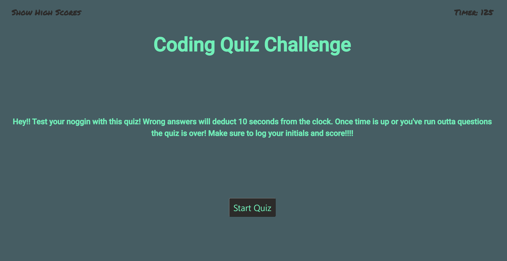
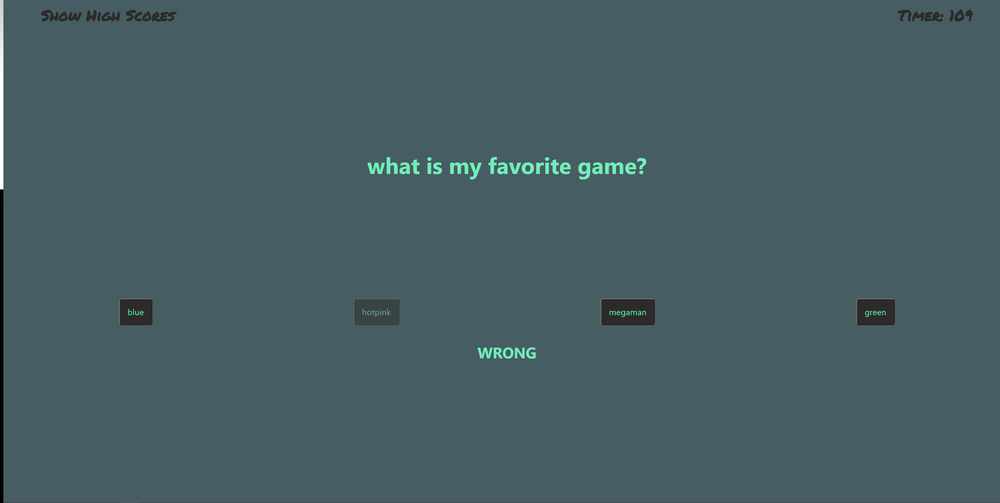
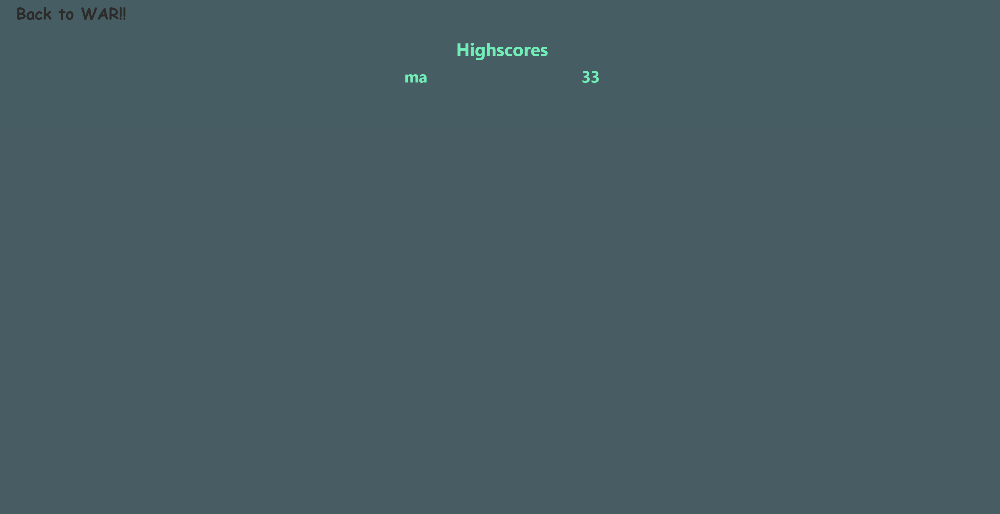

# Web API:  Code Quiz

## Acceptance Criteria

This week I had to build a timed coding quiz with multiple-choice questions. This app runs in the browser and features dynamically updated HTML and CSS powered by JavaScript code that i have written. The interface is intuitive and clean.

### installation

**Visit my page deployed via Github:**
https://malicea0783.github.io/Web-API-Code-Quiz/

**Clone my repo**
https://github.com/malicea0783/Web-API-Code-Quiz.git

